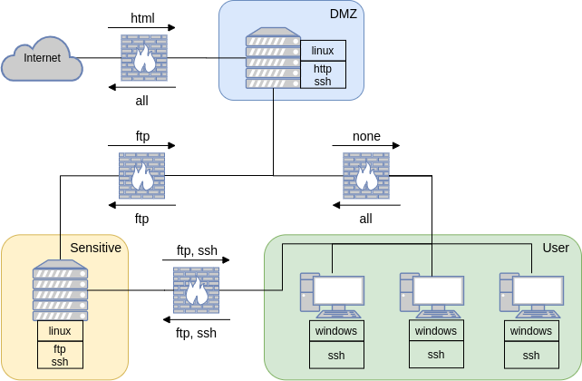

.. _`scenarios_tute`:

Understanding Scenarios
=======================

A scenario in NASim defines all the necessary properties for creating a network environment. Each scenario definition can be broken down into two components: the network configuration and the pen-tester.

Network Configuration
---------------------

The network configuration is defined by a the following properties:

- *subnets*: the number and size of the subnets in the network.
- *topology*: how the different subnets in the network are connected
- *host configurations*: the address, OS, services, processes, and firewalls for each host in the network
- *firewall*: which communication is prevented between subnets

*Note*, for the host configurations we are, in general, only interested in services and processes that the pen-tester has exploits for, so we will typically ignore any non-vulnerable services and processes in order to reduce the problem size.

Pen-Tester
----------

The pen-tester is defined by:

- *exploits*: the set of exploits available to the pen-tester
- *privescs*: the set of priviledge escalation actions available to the pen-tester
- *scan costs*: the cost of performing each type of scan (service, OS, process, and subnet)
- *sensitive hosts*: the target hosts on the network and their value

Example Scenario
----------------

To illustrate these properties here we show an example scenario, where the aim of the pen-tester is to gain root access to the server in the sensitive subnet and one of the hosts in the user subnet.

The figure below shows the the layout of our example network.

From the figure we can see that this network has the following properties:

- *subnets*: three subnets: DMZ with a single server, Sensitive with a single server and User with three user machines.
- *topology*: Only the DMZ is connected to the internet, while all subnets in network are interconnected.
- *host configurations*: The address, OS, services, and processes running on each host are shown next to each host (e.g. the server in the DMZ subnet has address (1, 0), has a linux OS, is running http and ssh services, and the tomcat process). The host firewall settings are show in the table in the top-right of the figure. Here only host *(1, 0)* has a firewall configured which blocks any SSH connections from hosts *(3, 0)* and *(3, 1)*.
- *firewall*: The arrows above and below the firwalls indicate which services can be communicated with in each direction between subnets and between the DMZ subnet and the internet (e.g. the internet can communicate with http services running on hosts in the DMZ, while the firewall blocks no communication from the DMZ to the internet).

Next we need to define our pen-tester, which we specify based on the scenario we wish to simulate.

- *exploits*: for this scenario the pen-tester has access to three exploits

  1. *ssh_exploit*: which exploits the ssh service running on windows machine, has a cost of 2, a success probability of 0.6, and results in user level access if successful.
  2. *ftp_exploit*: which exploits the ftp service running on a linux machine, has a cost of 1, a sucess probability of 0.9, and results in root level access if successful.
  3. *http_exploit*: which exploits the http service running on any OS, has a cost of 3, a success probability of 1.0, and results in user level access if successful.

- *privescs*: for this scenario the pen-tester has access to two priviledge escalation actions

  1. *pe_tomcat*: exploits the tomcat process running on a linux machine to gain root access. It has a cost of 1 and success probability of 1.0.
  2. *pe_daclsvc*: exploits the daclsvc process running on a windows machine to gain root access. It has a cost of 1 and success probability of 1.0.

- *scan costs*: here we need to specify the cost of each type of scan

  1. *service_scan*: 1
  2. *os_scan*: 2
  3. *process_scan*: 1
  4. *subnet_scan*: 1

- *sensitive hosts*: here we have two target hosts

  1. *(2, 0), 1000* : the server running on sensitive subnet, which has a value of 1000.
  2. *(3, 2), 1000* : the last host running on user subnet, which has a value of 1000.

And with that our scenario is fully defined and we have everything we need to run an attack simulation.
